# VRscapes : A tool for quantitative design research in VR environment

Application for designing and implementation, and data collection for user-experience and on-screen perception surveys in Immersive Virtual Reality environments. Researchers can select from variety of common experiment design parameters (randomization, group assignment, etc.), use their preferred immersive stimuli type and survey, and save the experiment results and user behavior metrics as analysis-ready text files. This is a great tool for researches whithout programming background to conduct rigorous psychological experiments in VR environment.  
  
 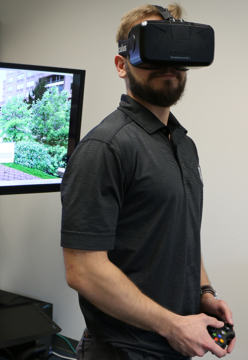

_________
# Features
## 1. Custom experiment design
- Between group design
- Within group designs
- Mixed design

Group A | Group B | Group C | ...  
--- | --- | --- | ---
scene 1A|scene 1B |scene 1C | ...
scene 2A|scene 2B |scene 2C | ...

### Participant assignment
|Get and record participant ID |Allow or disallow existing participant ID |Save participants list
| :---: | :----: | :----: |
|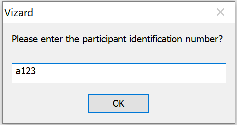| 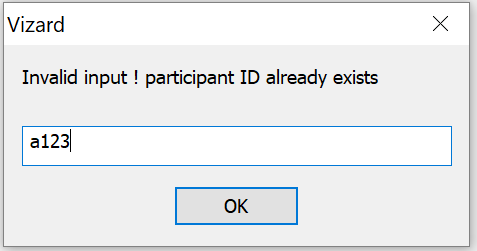|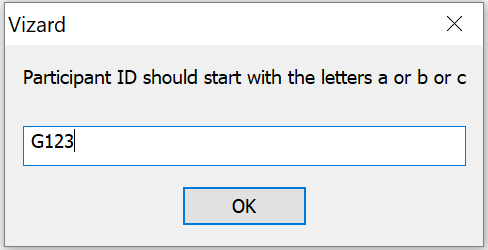|

### Experiment phasing
| Warmup and practice phase| Recess periods | Debriefing and finale phase
| :---: | :----: | :----: |
||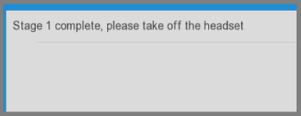|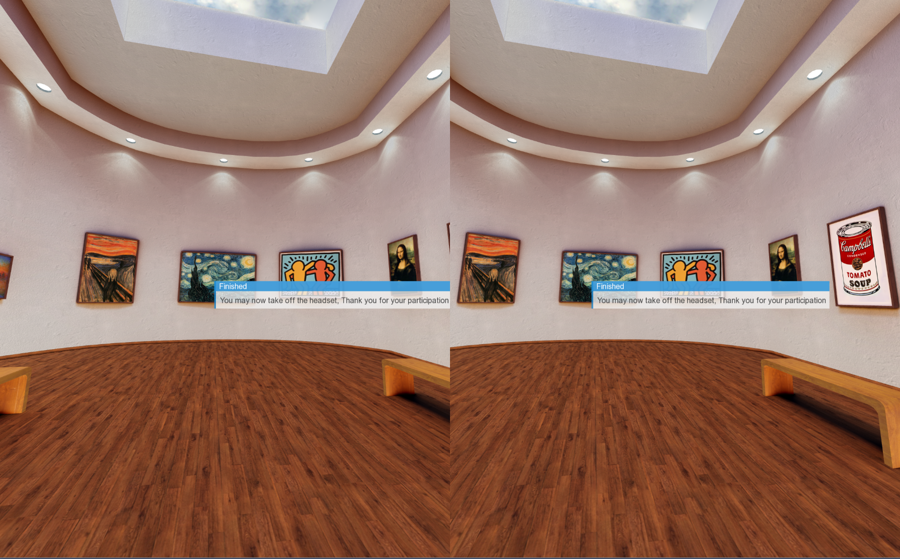|

### Timing
- Adjust the presentation duration of each scene
- Adjust the delay before the onset of the on-screen survey

### Survey design
- Custom survey items and scales (e.g., 1-10)
- Random / ordered survey presentation

_________
## 2. Custom stimuli type

360 Images (cube face projection)|360 Videos (spherical projection)|3D models|
| :---: | :----: | :----: |
|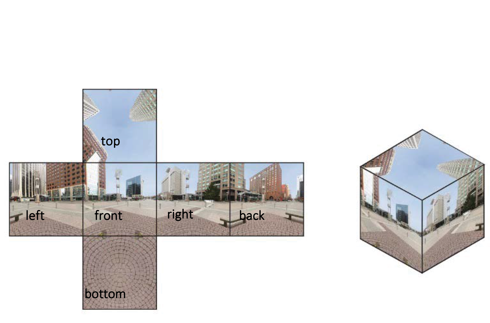|||
_________
## 3. Custom VR headset type

|Oculus Dk1|Oculus Dk2|Oculus CV1|HTC VIVE|
| :---: | :----: | :----: |:---:|
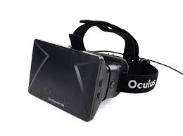|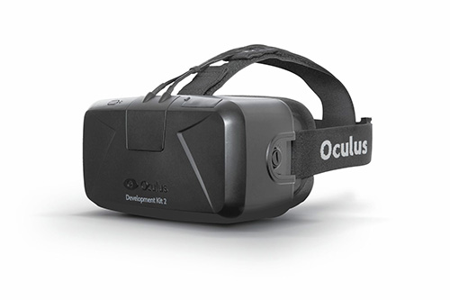|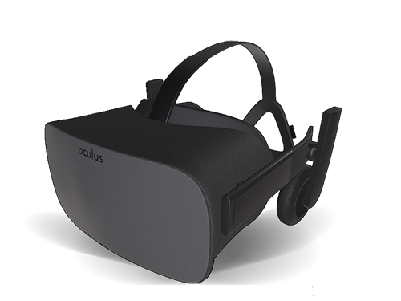|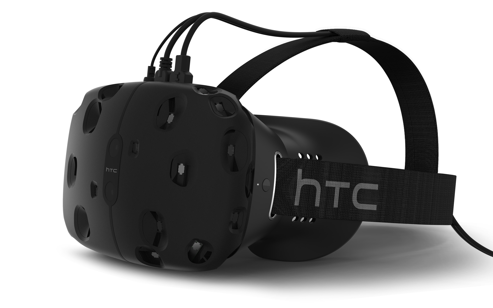|

_________
## 4. Custom interaction type

|Oculus Dk2|Oculus CV1|HTC VIVE|
| :---: | :----: | :----: |:---:|
- Joystick
- Oculus touch
- Voice recognition (coming soon)

_________
### Recording head-tracking

### Analysis-ready tab separated output file
