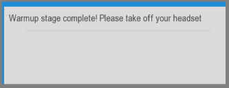
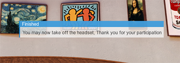
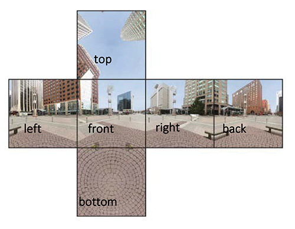

# VRscapes : A tool for quantitative design research in VR environment

Application for designing and implementation, and data collection for user-experience and on-screen perception surveys in Immersive Virtual Reality environments. Researchers can select from variety of common experiment design parameters (randomization, group assignment, etc.), use their preferred immersive stimuli type and survey, and save the experiment results and user behavior metrics as analysis-ready text files. This is a great tool for researches whithout programming background to conduct rigorous psychological experiments in VR environment.  
<br><br>
 

_________
# Features

## 1. Experiment design
- Between group design
- Within group designs
- Mixed design

Group A | Group B | Group C | ...  
--- | --- | --- | ---
scene 1A|scene 1B |scene 1C | ...
scene 2A|scene 2B |scene 2C | ...
_________
## 2. Participant assignment
|Get and record participant ID |Allow or disallow existing participant ID |Save participants list
| :---: | :----: | :----: |
|| ||
_________

## 3. Experiment phasing
| Warmup and practice phase| Recess periods | Debriefing and finale phase
| :---: | :----: | :----: |
||||

_________
## 4. Timing
- Adjust the presentation duration of each scene
- Adjust the delay before the onset of the on-screen survey

_________
## 5. Survey design
- Custom survey items and scales (e.g., 1-10)
- Random / ordered survey presentation


|||
| :---: | :----: |
| | |

_________
## 6. Custom stimuli type

360 Images (cube face projection)|360 Videos (spherical projection)|3D models|
| :---: | :----: | :----: |
||<a href="http://www.youtube.com/watch?v=Z8r0caXFdHo"></a>||
_________
## 7. Custom VR headset type

|Oculus Dk1|Oculus Dk2|Oculus CV1|HTC VIVE|
| :---: | :----: | :----: |:---:|
||||

_________
## 8. Custom interaction type

|Joystick|Oculus touch|Leap motion (coming soon)|
| :---: | :----: | :----: |
||||

_________
### Analysis-ready output


```
Scene           side       x              y           z
0_nature.png	3	front	  972.70111084	885.047119141	138.952880859
0_nature.png	3	front	  891.2890625	  874.664764404	149.335235596
0_nature.png	3	front	  784.580047607	836.517028809	187.482971191
0_nature.png	3	front	  738.302322388	872.624267578	151.375732422
0_nature.png	3	front	  770.977783203	978.449859619	45.5501403809
0_nature.png	3	bottom	5947.07226562	62.4846496582	961.515350342
0_nature.png	3	bottom	5966.37063599	140.469329834	883.530670166
0_nature.png	3	bottom	5967.42300415	206.965942383	817.034057617
0_nature.png	3	bottom	6058.60418701	174.909057617	849.090942383
0_nature.png	3	bottom	6026.56817627	118.979553223	905.020446777
0_nature.png	3	front	  748.643783569	975.29284668	48.7071533203
0_nature.png	3	front	  663.912582397	810.612518311	213.387481689
```
